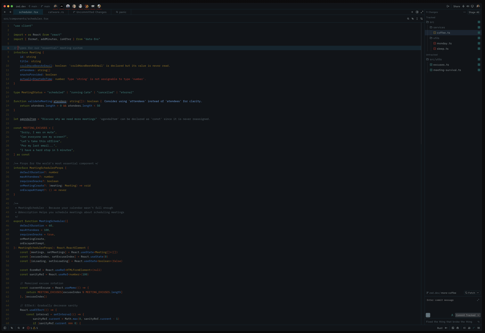

> [!IMPORTANT]
> Remove this line to confirm you've reviewed this PR before submitting.

# Solarized Osaka Deep for Zed

A Solarized-inspired dark theme for the [Zed editor](https://zed.dev), with a deeper, more saturated background palette.

Inspired by [craftzdog/solarized-osaka.nvim](https://github.com/craftzdog/solarized-osaka.nvim) and based on Ethan Schoonover's original [Solarized](https://ethanschoonover.com/solarized/) color scheme.

## Install

In Zed, open the command palette (`cmd-shift-p` / `ctrl-shift-p`) and run `zed: extensions`. Search for **Solarized Osaka Deep** and click Install.

Then activate it via `cmd-k cmd-t` (or `ctrl-k ctrl-t` on Linux) and pick **Solarized Osaka Deep**.

## Preview

Highlights:

- Deep teal backgrounds (`#0f1419` editor, `#002b36` panels)
- Solarized accent palette: cyan strings, blue functions, yellow types, green keywords
- Italic comments and control flow keywords
- Red caret (`#ff0000ca`) for high visibility
- Full Solarized ANSI terminal palette

## Acrylic preview

**Solarized Osaka Deep Acrylic** is an optional variant alongside the unchanged opaque **Solarized Osaka Deep**. It preserves Deep's palette, syntax styling, and ANSI colors, with native blurred transparency and an 80%-opaque background tint (`#0f1419cc`). Alpha controls opacity, not blur intensity; there is no blur intensity setting. Panels, popups, and the terminal remain opaque for readability.

The author has visually tested Acrylic on macOS only; Windows and Linux have not been tested. Native blur behavior depends on the platform.

To try this preview without rebuilding Zed or installing a registry extension:

1. Open [the Acrylic theme JSON](themes/solarized-osaka-deep-acrylic.json) from this preview branch or PR, then download **Raw** (not the file from `main`).
2. Save it as `~/.config/zed/themes/solarized-osaka-deep-acrylic.json` on macOS or Linux, creating the `themes` directory if needed. On Windows, use `%USERPROFILE%\AppData\Roaming\Zed\themes\solarized-osaka-deep-acrylic.json`.
3. Run `theme selector: toggle` in Zed's command palette and select **Solarized Osaka Deep Acrylic**. Restart Zed if it is absent; if the appearance has not updated, switch away and back or open a fresh window.

## Development

Clone and install as a dev extension:

```bash
git clone https://github.com/mauriciord/zed-solarized-osaka-theme.git
```

In Zed: `cmd-shift-p` → `zed: install dev extension` → select the cloned directory.

Edit `themes/solarized-osaka.json` and reload via `zed: reload extensions` to see changes.

## Credits

- [Solarized](https://ethanschoonover.com/solarized/) by Ethan Schoonover — the original palette
- [solarized-osaka.nvim](https://github.com/craftzdog/solarized-osaka.nvim) by Takuya Matsuyama — the Neovim variant that inspired the deeper background tones

## License

MIT — see [LICENSE](./LICENSE).

## Preview


